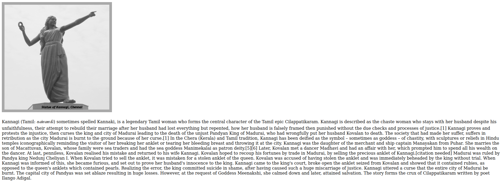
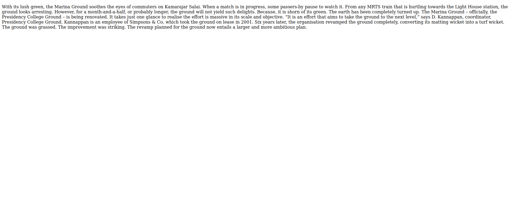
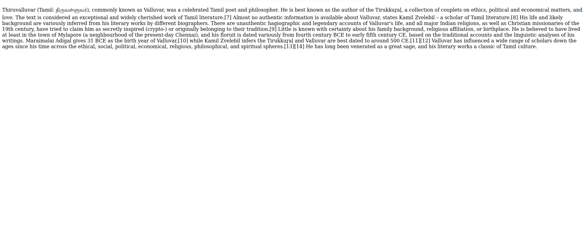
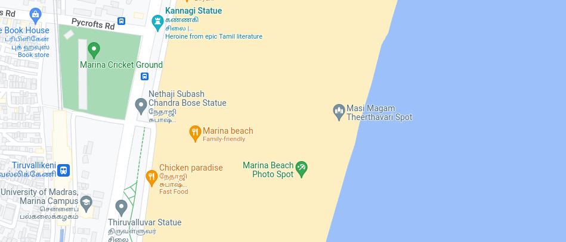

# Places Around Me
## AIM:
To develop a website to display details about the places around my house.

## Design Steps:

### Step 1:
create a image map and html code for every places
### Step 2:
push the code to github
## Code:
```
<!DOCTYPE html>

<head>
            <title>map of marina</title>

            <meta charset='utf-8'>
            <meta http-equiv='X-UA-Compatible' content='IE=edge'>
            <meta name='viewport' content='width=device-width, initial-scale=1'>  
        </head>
    <style>
            
    </style>
</head>
<body>


    <!-- Image Map Generated by http://www.image-map.net/ -->


<map name="image-map">
    <area target="_self" alt="kannagi statue" title="kannagi statue" href="kannagistatue.html" coords="246,0,660,94" shape="rect">
    <area target="_self" alt="marina cricketground" title="marina cricketground" href="marinacricketground.html" coords="2,0,223,209" shape="rect">
    <area target="_self" alt="nethaji statue" title="nethaji statue" href="nethajistatue.html" coords="227,102,394,264" shape="rect">
    <area target="_self" alt="valluvar statue" title="valluvar statue" href="valluvar.html" coords="156,270,396,406" shape="rect">
    <area target="_self" alt="university of madras" title="university of madras" href="universityofmadras.html" coords="1,214,153,406" shape="rect">
</map>

    
    
    
</body>
```

## Output:




s


## Result:
thus the experiment completed sucessfully